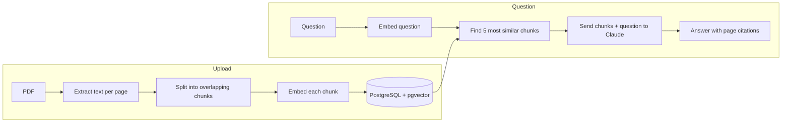

# AI Document Assistant


Upload a PDF and ask questions about it. Answers are grounded in the document,
cite page numbers, and say so when the document doesn't contain the answer.

Built with retrieval-augmented generation (RAG): instead of sending the whole
document to the AI on every question, the app finds the most relevant passages
using semantic search and sends only those.


## Features

- **PDF upload** with text extraction that keeps track of page numbers
- **Semantic search** over document chunks using embeddings and pgvector
- **Grounded answers** from Claude, with page citations and an explicit
  "not in the document" response instead of guessing
- **Document library**: revisit or delete previously uploaded PDFs
- **Persistent storage** in PostgreSQL, so documents survive restarts
- **One-command setup** with Docker Compose
- **Automated tests and CI** on every push

## Tech stack

| Area | Technology |
| --- | --- |
| Backend | Python, FastAPI, Pydantic |
| AI | Claude API (Anthropic) |
| Embeddings | sentence-transformers (`all-MiniLM-L6-v2`, runs locally) |
| Database | PostgreSQL + pgvector |
| Frontend | React (Vite), react-markdown |
| Infrastructure | Docker, Docker Compose, nginx |
| Testing / CI | pytest, FastAPI TestClient, GitHub Actions, ESLint |

## How it works



1. **Extraction:** text is pulled from each page separately, so every chunk
   remembers which page it came from.
2. **Chunking:** pages are split into ~200-word chunks with a 40-word overlap,
   so a sentence cut at a chunk boundary still appears whole in one of them.
3. **Embedding:** each chunk is turned into a 384-dimensional vector that
   represents its meaning. This happens once, at upload time.
4. **Retrieval:** the question is embedded the same way, and pgvector finds
   the chunks with the highest cosine similarity.
5. **Generation:** only the top 5 chunks are sent to Claude, with a system
   prompt instructing it to answer only from the provided text and cite pages.

## Design decisions

- **Retrieve several chunks, not one.** Semantic search is imperfect. In testing,
  the correct slide for "How do we choose the step size?" ranked 4th, not 1st.
  Retrieving the top 5 lets the model pick out what's relevant.
- **Grounding over general knowledge.** The system prompt tells the model to
  say when the answer isn't in the document. Asking about a topic the notes
  don't cover produces "the document doesn't cover this" rather than a
  confident answer from elsewhere.
- **Local embedding model.** Embeddings run on the server with
  sentence-transformers. It's free, needs no extra API key, and keeps the
  document text away from a second provider.
- **Same interface, swappable storage.** The in-memory `Retriever` and the
  database-backed `DatabaseRetriever` share a `search()` method, so the RAG
  pipeline works with either without changes.
- **Mocked tests.** Tests replace the Claude API and the database with fakes,
  so they're fast, free and deterministic.

## API

| Method | Endpoint | Description |
| --- | --- | --- |
| `GET` | `/health` | Health check |
| `POST` | `/documents` | Upload a PDF (chunked and embedded on upload) |
| `GET` | `/documents` | List uploaded documents, newest first |
| `POST` | `/documents/{id}/ask` | Ask a question about a document |
| `DELETE` | `/documents/{id}` | Delete a document and its chunks |

Interactive API docs are available at `http://localhost:8000/docs` when running.

## Running it locally

**Requirements:** Docker Desktop and an [Anthropic API key](https://console.anthropic.com).

```bash
git clone https://github.com/dwaynekave12/ai-document-assistant.git
cd ai-document-assistant
cp .env.example .env        # on Windows: copy .env.example .env
```

Put your API key in `.env`, then:

```bash
docker compose up --build
```

Open **http://localhost:5173**. The first build takes a few minutes.

### Development mode (live reload)

```bash
docker compose up -d db                  # database only
python -m venv .venv                     # then activate it
pip install -r requirements.txt
uvicorn main:app --reload                # backend on :8000

cd frontend
npm install
npm run dev                              # frontend on :5173
```

## Tests

```bash
python -m pytest -v
```

Covers chunking logic, the Claude integration (including a regression test for
responses that start with a thinking block), and every API endpoint's status
codes and response shape. GitHub Actions runs the backend tests, frontend lint
and a production build on every push.

## Limitations and future improvements

- **No authentication.** All documents are visible to anyone using the app.
  Adding user accounts with ownership checks on every request would be
  required before any public deployment.
- **Text-only extraction.** Scanned PDFs (images of text) are rejected; OCR
  would be needed to support them. Tables and equations extract as messy text.
- **Retrieval quality.** A larger embedding model, hybrid keyword + semantic
  search, or re-ranking could improve results. Summary-style questions are a
  known weak spot, since they need the whole document rather than 5 chunks.
- **Duplicate slides.** Lecture slides that repeat content produce near-identical
  chunks that take up retrieval slots.
- **Single conversation turn.** Each question is answered independently; the
  model doesn't see earlier questions in the chat.